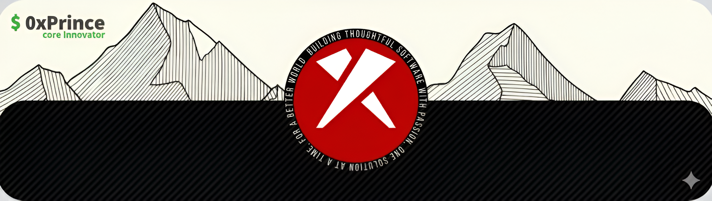

 
  

    Hey! 👋 I’m <b>Prince</b>, also known as <b>0xPrince</b>, a coder from India driven by <b>Core  Innovator, & System Security</b> and <b>Enthusiast</b>.
    I love diving into complex algorithms and transforming data into <b>impactful projects</b> that solve problems and inspire innovation.
    Off the keyboard, I’m either vibing to music or immersed in the storytelling craft of cinematography.
  

    

    
    
    
    
    
    
    
    
    
    
    
    
    
    
    
    
    
    
    
    
    
    
    
    

 

    I’m <b><i>deeply passionate</i></b> about creating <i><b>innovative solutions</b></i> and bringing <i><b>impactful ideas</b></i> to life. If you’re excited to build something <i><b>truly extraordinary</b></i> or collaborate on a <i><b>meaningful project</b></i>, let’s connect and create something <i><b>remarkable</b>.</i>

  

  

  
