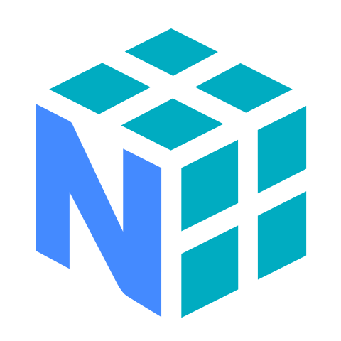

Hey! 👋 I’m <b>Prince</b>, also known as <b>0xPrince</b>, a coder from India driven by  
<b>Core Innovation</b>, <b>System Security</b>, and <b>Engineering Excellence</b>.  
I love diving into complex algorithms and transforming ideas into  
<b>impactful real-world solutions</b>.  
Off the keyboard, I’m vibing to music or immersed in cinematography 🎬

 
 

<b><i>Deeply passionate</i></b> about building  
<i><b>innovative, secure, and impactful systems</b></i>.  
If you want to collaborate on something <b>meaningful</b>,  
let’s create something <b>extraordinary</b> 🚀

Made with 💌 by <b>0xPrince</b>  
<i>Last updated: January 2026 · v1.0</i>

